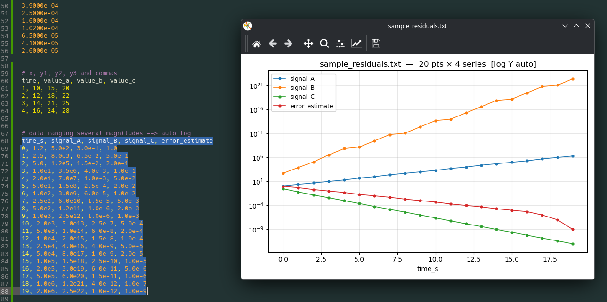

# KDE Kate Quick-Plot plugin 

Vibe-coded Kate plugin.

Select two (or more) columns of numbers in Kate, hit a shortcut, get an instant Y-vs-X plot.
Built for visually inspecting convergence / residual output files.

## 1. Install Kate and matplotlib

## 2. Install the plot script

For example in:
```bash
mkdir -p ~/.local/bin
cp kate_quickplot.py ~/.local/bin/
chmod +x ~/.local/bin/kate_quickplot.py
```

## 3. Register the External Tool in Kate

Kate → **Settings → Configure Kate → External Tools → Add…**

Fill in:

| Field         | Value                                  |
| ------------- | -------------------------------------- |
| Name          | `Quick-Plot Selection`                 |
| Icon          | `office-chart-line` (any icon is fine) |
| Executable    | `python3`                              |
| Arguments     | `%{ENV:HOME}/.local/bin/kate_quickplot.py --title "%{Document:FileName}"` |
| Input         | `%{Document:Selection:Text}`           |
| Output        | Ignore                                 |
| Working Dir   | `%{Document:Path}`                     |
| Command       | `quickplot`                            |

Kate expands `%{Document:Selection:Text}` in the **Input** field and pipes that
text into the script's stdin — exactly what `kate_quickplot.py` expects.

### Assign the keyboard shortcut

Settings → Configure Shortcuts  → Quick-Plot Selection →
use e.g. `Ctrl+Alt-Gr+P` → Apply.

## 4. Use it

Select text, either by block mode or normal.

- If one columns selected → plot versus line number
- If X,Y1,Y2,Y3 etc selected → plot with (X, Y1, Y2, etc) legend.
- If header in columns included → plot with (header X, header Y1, header Y2, etc) legend.



Supported separators (auto-detected): spaces, tabs, commas, semicolons.

