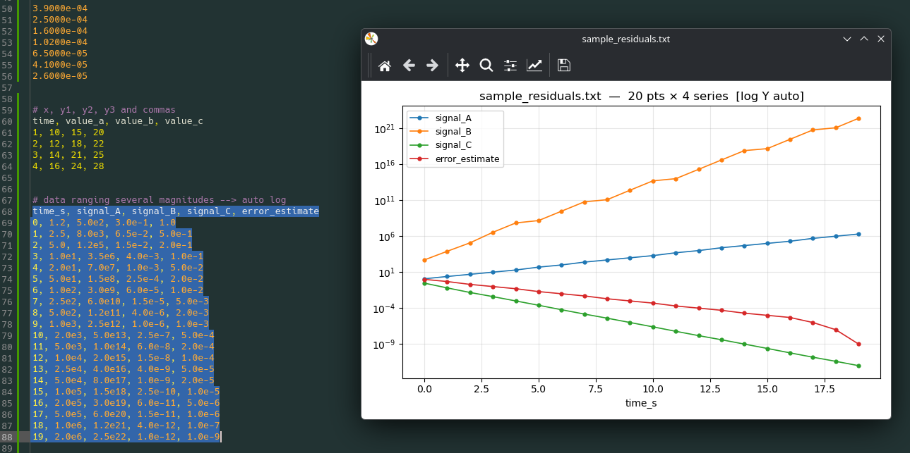

# KDE Kate Quick-Plot plugin 

Vibe-coded Kate plugin.

Select two (or more) columns of numbers in Kate, hit a shortcut, get an instant Y-vs-X plot.
Built for visually inspecting convergence / residual output files.

## 1. Install Kate and matplotlib

## 2. Install the plot script

For example in:
```bash
mkdir -p ~/.local/bin
cp kate_quickplot.py ~/.local/bin/
chmod +x ~/.local/bin/kate_quickplot.py
```

## 3. Register the External Tool in Kate

Kate → **Settings → Configure Kate → External Tools → Add…**

Fill in:

| Field         | Value                                  |
| ------------- | -------------------------------------- |
| Name          | `Quick-Plot Selection`                 |
| Icon          | `office-chart-line` (any icon is fine) |
| Executable    | `python3`                              |
| Arguments     | `%{ENV:HOME}/.local/bin/kate_quickplot.py --title "%{Document:FileName}"` |
| Input         | `%{Document:Selection:Text}`           |
| Output        | Ignore                                 |
| Working Dir   | `%{Document:Path}`                     |
| Command       | `quickplot`                            |

Kate expands `%{Document:Selection:Text}` in the **Input** field and pipes that
text into the script's stdin — exactly what `kate_quickplot.py` expects.

### Assign the keyboard shortcut

Settings → Configure Shortcuts  → Quick-Plot Selection →
use e.g. `Ctrl+Alt-Gr+P` → Apply.

## 4. Use it

Select text, either by block mode or normal.

- If one columns selected → plot versus line number
- If X,Y1,Y2,Y3 etc selected → plot with (X, Y1, Y2, etc) legend.
- If header in columns included → plot with (header X, header Y1, header Y2, etc) legend.



Supported separators (auto-detected): spaces, tabs, commas, semicolons.

## 5. Interactive controls (in the plot window):
    Left-click a legend entry   : show/hide that curve
    Right-click a legend entry  : mark it as a "relative error" source
                                   (fraction, e.g. 0.05 = 5%, not absolute
                                   sd/std). Then left-click a different
                                   legend entry to attach that relative
                                   error to it -> the target curve is
                                   redrawn as an errorbar plot with
                                   yerr = y * relative_error, and both
                                   original curves are hidden.
    'a'                          : show all curves (does not undo pairings)
    'u'                          : undo the most recent error-bar pairing
    'r'                          : full reset (undo all pairings, show all)
    't'                          : arm/disarm threshold-line placement mode;
                                   while armed, left-click anywhere on the
                                   axes (not on a legend entry) to draw a
                                   dashed horizontal line at that y-value.
                                   Pressing 't' again while a line exists
                                   removes it instead of re-arming.
    'm'                          : toggle a moving-average overlay (dashed,
                                   same color, thinner) on all currently
                                   visible curves. Window size is auto-set
                                   to max(3, npoints // 20).
    Plot axes autoscale to only the currently visible curves after every
    toggle or pairing/undo/reset action.

